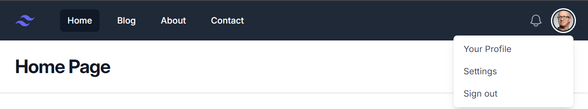
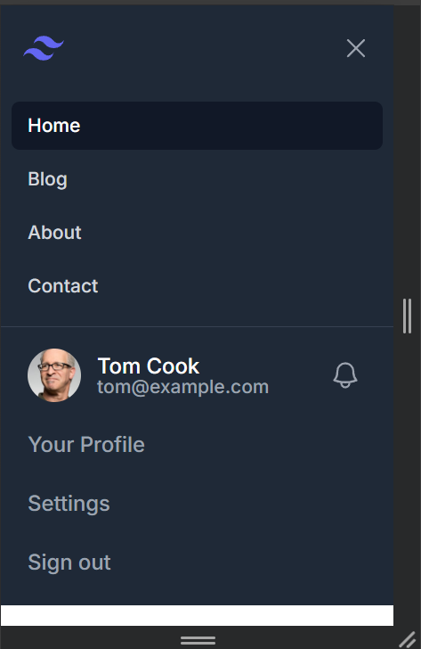
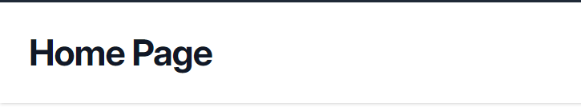
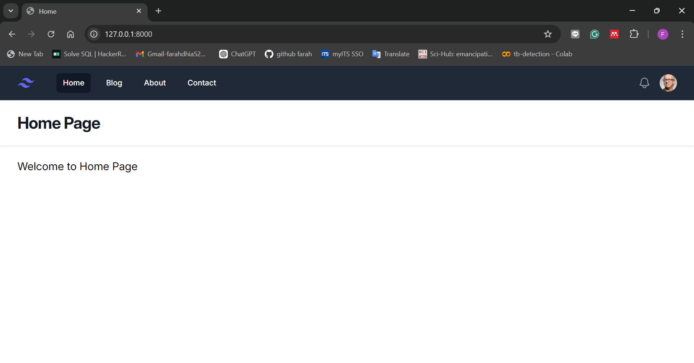
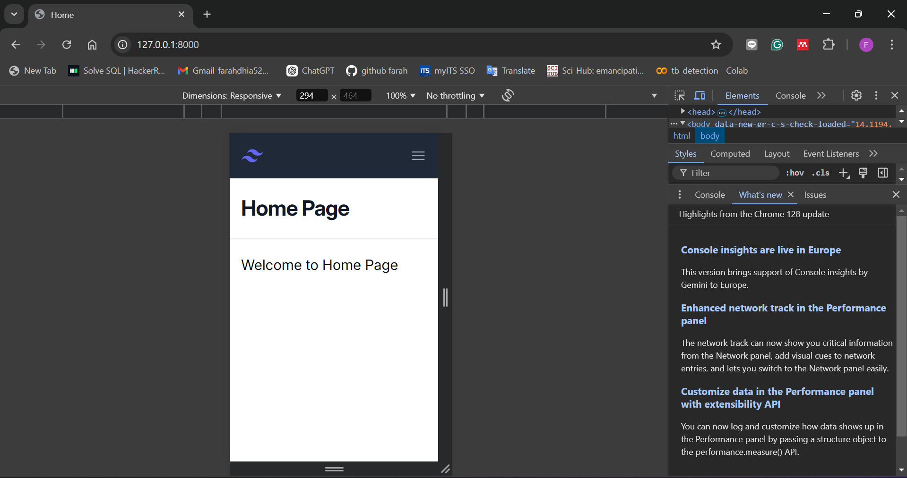
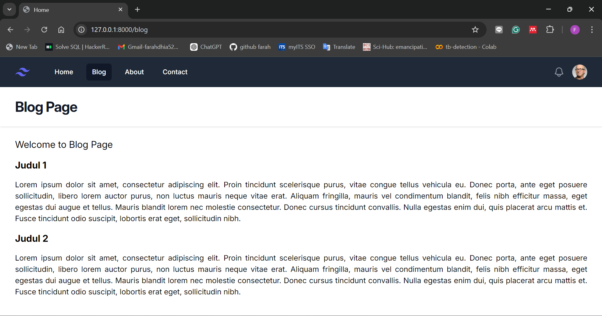
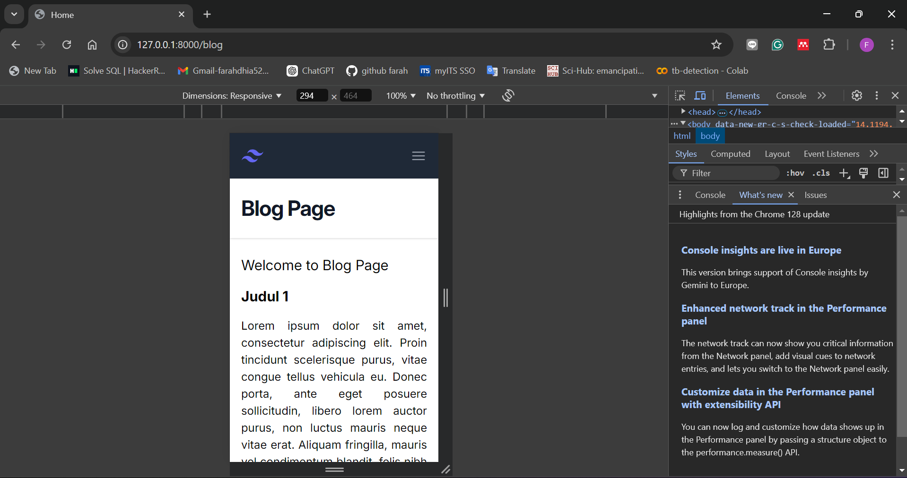
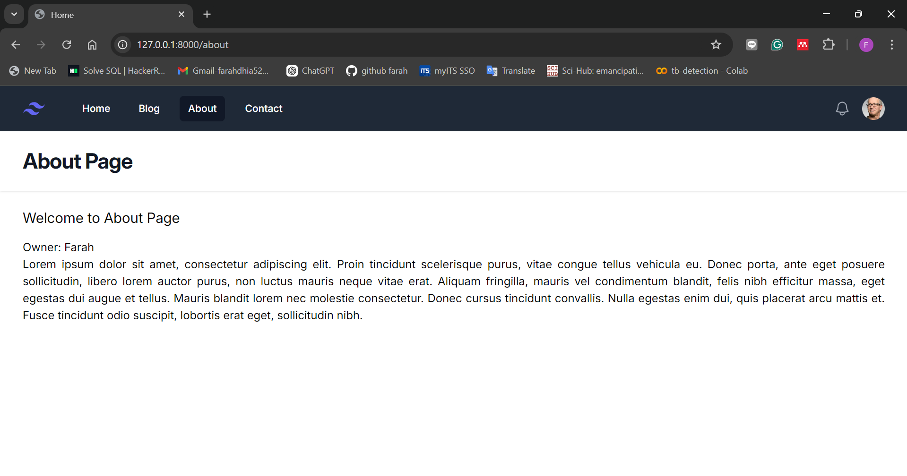
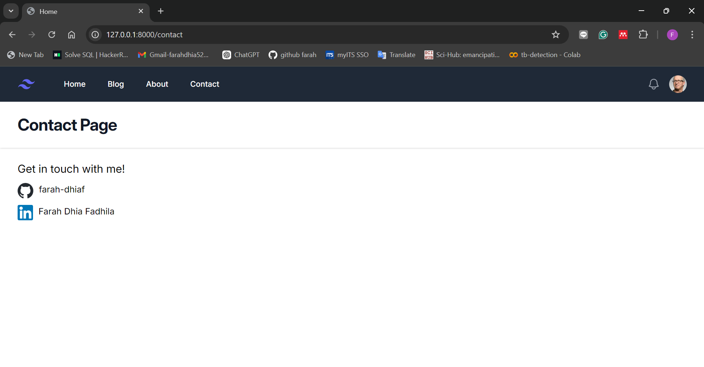
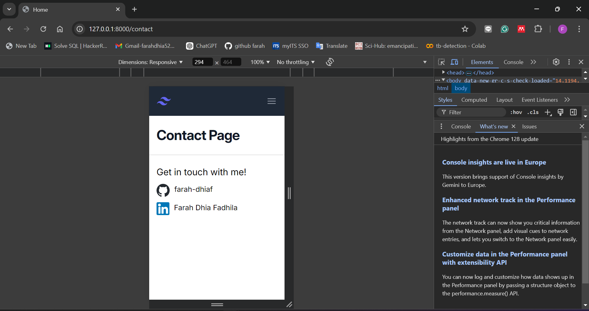

# Assignment 1

Saya mengikuti semua tutorial dari section 2 di classroom terkait struktur folder dan Blade. Pada project Laravel ini saya menggunakan environtment `Laragon` dan menggunakan template tampilan UI dari `Tailwind`.

Cara menjalankan project:</br>

1. Jalankan aplikasi Laragon dan klik `Start All` untuk mengaktifkan layanan Apache serta MySQL.
2. Masuk ke direktori project dengan klik Terminal dan ketik `cd <nama-project>`
3. Jalankan server dengan `php artisan serve` di terminal.
4. Setelah itu, jalankan `npm run dev` untuk compile asset JavaScript dan Tailwind CSS.
5. Akses website di browser pada `localhost:8000`

</br>

Pada website kali ini memiliki beberapa komponen yakni navbar, header, dan main yang diatur dalam `layout` dimana slot akan berisikan konten spesifik pada setiap halaman.

```
<!DOCTYPE html>
<html lang="en">
<head>
    <meta charset="UTF-8">
    <meta name="viewport" content="width=device-width, initial-scale=1.0">
    @vite('resources/css/app.css')
    <link rel="stylesheet" href="https://rsms.me/inter/inter.css">
    <script defer src="https://cdn.jsdelivr.net/npm/alpinejs@3.x.x/dist/cdn.min.js"></script>
    <title>Home</title>
</head>
<body>
<div class="min-h-full">
<x-navbar></x-navbar>
<x-header>{{$title}}</x-header>
  <main>
    <div class="mx-auto max-w-7xl px-4 py-6 sm:px-6 lg:px-8">
      {{$slot}}
    </div>
  </main>
</div>

</body>
</html>
```

Beberapa komponen di dalam layout antara lain:

1. Navbar</br>
   Merupakan komponen navigasi antar halaman, terdiri atas navigasi halaman Home, Blog, About, Contact, dan juga terdapat dropdown untuk mengakses profil pengguna. Tampilan ini bersifat responsif yang bisa diakses oleh pengguna mobile.

   - Tampilan website
     
     ```
     <a {{$attributes}} class="{{ $active ? 'bg-gray-900 text-white' : 'text-gray-300 hover:bg-gray-700 hover:text-white'}} rounded-md px-3 py-2 text-sm font-medium text-white" aria-current="{{ $active ? 'page' : false}}">{{$slot}}</a>
     ```
     - `$attributes` akan mem-parsing data halaman yang sedang diakses, dalam hal ini akan mengambil data URL pada setiap halaman.
     - `$active` merupakan boolean untuk menyatakan apakah halaman sedang aktif sesuai dengan link URL.
     - `$slot` akan berisikan komponen di dalam NavLink tersebut.

     Berikut adalah penggunaannya.
     ```
     <x-nav-link href="/" :active="request()->is('/')">Home</x-nav-link>
     <x-nav-link href="/blog" :active="request()->is('blog')">Blog</x-nav-link>
     <x-nav-link href="/about" :active="request()->is('about')">About</x-nav-link>
     <x-nav-link href="/contact" :active="request()->is('/contact')">Contact</x-nav-link>
     ```

   - Tampilan mobile
     
     ```
     <a {{$attributes}} class="{{$active ? 'bg-gray-900 text-white ' : 'text-gray-300 hover:bg-gray-700 hover:text-white '}} block px-3 py-2 text-sm font-medium rounded-md block px-3 py-2 text-sm font-medium rounded-md"aria-current="{{$active ? 'page' : false}}">{{$slot}}</a>
     ```
     Sama seperti NavLink pada website, yang dibedakan hanya tampilannya yang ditujukan untuk mobile. Berikut adalah penggunaannya.
     ```
     <x-navlink-mobile href="/" :active="request()->is('/')">Home</x-navlink-mobile>
     <x-navlink-mobile href="/blog" :active="request()->is('blog')">Blog</x-navlink-mobile>
     <x-navlink-mobile href="/about" :active="request()->is('about')">About</x-navlink-mobile>
     <x-navlink-mobile href="/contact" :active="request()->is('contact')">Contact</x-navlink-mobile>
     ```

2. Header</br>
   Merupakan komponen yang berisi judul halaman yang sedang aktif.
   

3. Halaman web</br>
   Pada halaman web akan terbagi menjadi beberapa halaman sebagai berikut. 1. Home </br>
   Halaman ini merupakan halaman awal ketika website pertama kali diakses. - Tampilan website </br>
    - Tampilan mobile </br>
    2. Blog </br>
   Halaman ini berisikan sejumlah konten untuk artikel atau blog yang memberikan informasi atau wawasan terhadap pembaca. - Tampilan website </br>
    - Tampilan mobile </br>
    3. About </br>
   Halaman ini memuat tentang pemilik dari website. - Tampilan website </br>
    - Tampilan mobile </br>
    4. Contact </br>
   Halaman ini mencantumkan informasi terkait kontak pemilik website. - Tampilan website </br>
    - Tampilan mobile </br>
   
